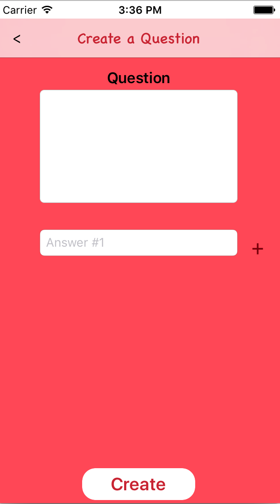
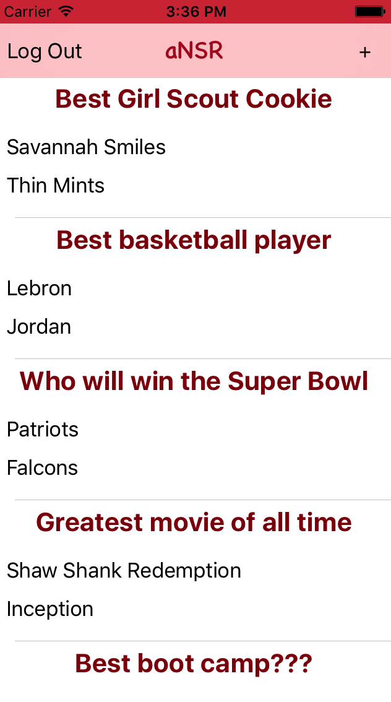

# aNSR

[App Store](https://itunes.apple.com/us/app/ansr/id1205656376?mt=8)

[demo](https://appetize.io/app/dukc8nv13vgxv4vxrxqaxaytk0?device=iphone6s&scale=75&orientation=portrait&osVersion=10.0)


## Background

aNSR is an iOS app built using Swift and Google's Firebase backend. aNSR is intended to be
a social media app created to settle heated debates between friends. Users may add questions
with up to 5 answers. Every user may then vote once per question on the aNSR they think is right!

## Features and Implementation

### User Authentication
User authentication is done by using Firebase's built in authentication feature to check for validation of user email and password.
The user data will be saved to the firebase database once it passes the authentication.
```
    func signUp(withEmail: String, username: String, password: String, loginHandler: LoginHandler?) {
        FIRAuth.auth()?.createUser(withEmail: withEmail, password: password, completion: { (user, error) in
            if error != nil {
                self.handleErrors(err: error as! NSError, loginHandler: loginHandler);
            } else {
                if user?.uid != nil {
                    // save to database
                    DBProvider.instance.saveUser(withID: user!.uid, email: withEmail, username: username);

                    // sign in the user
                    FIRAuth.auth()?.signIn(withEmail: withEmail, password: password, completion: { (user, error) in
                        if error != nil {
                            self.handleErrors(err: error as! NSError, loginHandler: loginHandler);
                        } else {
                            loginHandler?(nil);
                        }
                    });
                }
            }
        });
    }
```

### Creating questions



Users are able to create their own questions with at least 2 answers for others to vote on. Questions are
then saved to the database upon creation and appear on the questions feed.

### Question news feed



All of the questions are rendered into the a UITableView for display. Questions along with the first two answers are rendered on the 'news feed' home page. Here users may browse all the questions in our database or add a question of their own. They
may click on each question for further detail.

### Question Detail


#### Votes

All answer choices on the question will be rendered to the question detail page.
Users are able to vote for an answer by clicking on the the answer button. The bar chart and pie chart will
be updated after the user votes.


#### Bar graph and Pie charts
Votes are rendered onto the question detail view page in two forms: A bar graph showing
the total votes per answer, and a pie chart showing the percentage of votes for each answer.
Both of the charts are rendered with Charts, an open source UI library.

```
    func updateChartWithData() {
        //getting data
        var dataEntries: [BarChartDataEntry] = []
        for i in 0..<self.votes.count {
            let dataEntry = BarChartDataEntry(x: Double(i), y: Double(self.votes[i]))
            dataEntries.append(dataEntry)
        }
        let chartDataSet = BarChartDataSet(values: dataEntries, label: "Answer Choices")
        let chartData = BarChartData(dataSet: chartDataSet)
        barView.data = chartData

        //Setting Chart Property
        barView.rightAxis.axisMinimum = 0.0
        barView.leftAxis.axisMinimum = 0.0
        barView.legend.enabled = false
        let xAxis:XAxis = barView.xAxis
        xAxis.drawGridLinesEnabled = false
        barView.leftAxis.drawGridLinesEnabled = false
        barView.rightAxis.drawGridLinesEnabled = false
        xAxis.drawLabelsEnabled = false
        barView.leftAxis.granularityEnabled = true
        barView.leftAxis.granularity = 1.0
        barView.rightAxis.granularityEnabled = true
        barView.rightAxis.granularity = 1.0
        barView.drawValueAboveBarEnabled = true;
        barView.descriptionText = ""
        chartDataSet.colors = ChartColorTemplates.colorful()
        barView.xAxis.labelPosition = .bottom
        barView.animate(xAxisDuration: 2.0, yAxisDuration: 2.0)
    }
```


### Search bar and question feed sort

Users will be able to search for a specific question or sort their feed by time created or most voted.

### Delete questions

Users who create questions will be able to delete them as well

### User profile

Users are able to customize their profile and update their username, password or email address

## Future Implementations

- Implement comments section for each of the questions
- Implement a search bar on news feed to allow user to search for question
- Create user profile dashboard
- Shared in facebook
- Marketing the app
- Android Support
