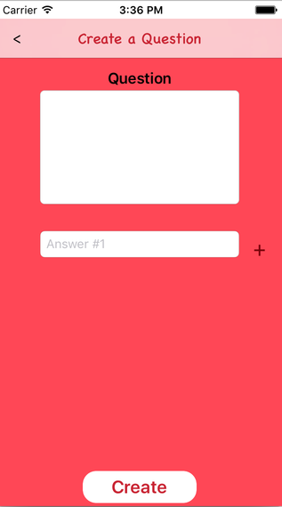
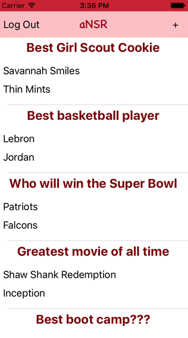
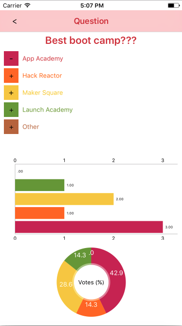

# aNSWR

[App Store]

[demo](https://appetize.io/app/ju9njhn5dgang3pekrkwd4v4em?device=iphone7&scale=75&orientation=portrait&osVersion=10.0)


## Background

aNSWR is an iOS app built using swift and google's firebase backend. aNSWR is intended to be
a social media app created to settle heated debates between friends. User's may add questions
with up to 5 answers. Every user may then vote once per question on the aNSWR they think is right!

## Features and Implementation

### User Authentication
User authentication is done by using Firebase built in authentication feature to check for validation of email and password.
The user data will be saved to the firebase database once it passed the authentication.
```
    func signUp(withEmail: String, username: String, password: String, loginHandler: LoginHandler?) {
        FIRAuth.auth()?.createUser(withEmail: withEmail, password: password, completion: { (user, error) in
            if error != nil {
                self.handleErrors(err: error as! NSError, loginHandler: loginHandler);
            } else {
                if user?.uid != nil {
                    // save to database
                    DBProvider.instance.saveUser(withID: user!.uid, email: withEmail, username: username);

                    // sign in the user
                    FIRAuth.auth()?.signIn(withEmail: withEmail, password: password, completion: { (user, error) in
                        if error != nil {
                            self.handleErrors(err: error as! NSError, loginHandler: loginHandler);
                        } else {
                            loginHandler?(nil);
                        }
                    });
                }
            }
        });
    }
```

### Creating questions



User's will be able to create their own questions with at least 2 answers for others vote on. Questions are
then saved to the database upon creation and appear on the questions feed.

### Question news feed



All of the questions will be rendered into the a UITableView for display
Questions along with the first two answers are rendered on the 'news feed' home page.
It is here users may browse all the questions in our database or add a question of their own and
may click on each question for further detail.

###Question Detail



#### Votes
2 or more answer choices on the question will be rendered to the question detail page.
User able to vote for the answer by clicking on the the answer button. The bar chart and pie chart will
be updated after the user votes.


#### Bar graph and Pie charts
Votes are rendered onto the question detail view page in two forms. A bar graph showing
the total votes per answer and a pie chart showing the percentage of votes for each answer.
Both of the charts are rendered with Charts, an open source UI library.

```
    func updateChartWithData() {
        //getting data
        var dataEntries: [BarChartDataEntry] = []
        for i in 0..<self.votes.count {
            let dataEntry = BarChartDataEntry(x: Double(i), y: Double(self.votes[i]))
            dataEntries.append(dataEntry)
        }
        let chartDataSet = BarChartDataSet(values: dataEntries, label: "Answer Choices")
        let chartData = BarChartData(dataSet: chartDataSet)
        barView.data = chartData

        //Setting Chart Property
        barView.rightAxis.axisMinimum = 0.0
        barView.leftAxis.axisMinimum = 0.0
        barView.legend.enabled = false
        let xAxis:XAxis = barView.xAxis
        xAxis.drawGridLinesEnabled = false
        barView.leftAxis.drawGridLinesEnabled = false
        barView.rightAxis.drawGridLinesEnabled = false
        xAxis.drawLabelsEnabled = false
        barView.leftAxis.granularityEnabled = true
        barView.leftAxis.granularity = 1.0
        barView.rightAxis.granularityEnabled = true
        barView.rightAxis.granularity = 1.0
        barView.drawValueAboveBarEnabled = true;
        barView.descriptionText = ""
        chartDataSet.colors = ChartColorTemplates.colorful()
        barView.xAxis.labelPosition = .bottom
        barView.animate(xAxisDuration: 2.0, yAxisDuration: 2.0)
    }
```

## Future Implementations

### Search bar and question feed sort

Users will be able to search for a specific question or sort their feed by time created or most voted.

### Delete questions

Users who create questions will be able to delete them as well

### User profile

Users will be able to customize their profile and update their username or password

### Android Support

App will be available to android users
